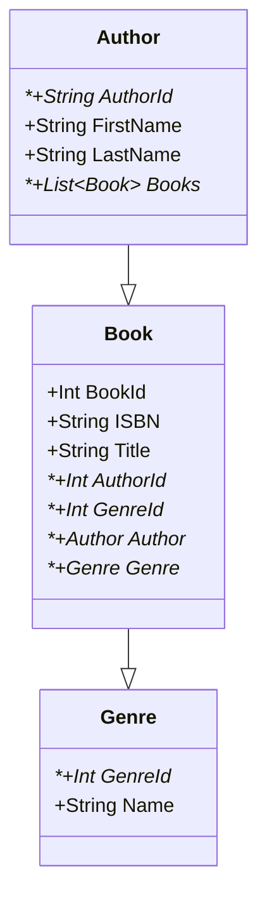

```mermaid
classDiagram
    class Author{
        *+String AuthorId*
        +String FirstName
        +String LastName
        *+List~Book~ Books*
    }
    class Book{
        +Int BookId
        +String ISBN
        +String Title
        *+Int AuthorId*
        *+Int GenreId*
        *+Author Author*
        *+Genre Genre*
    }
    Author --|> Book
    class Genre{
        *+Int GenreId*
        +String Name
    }
    Book --|> Genre
    
```
