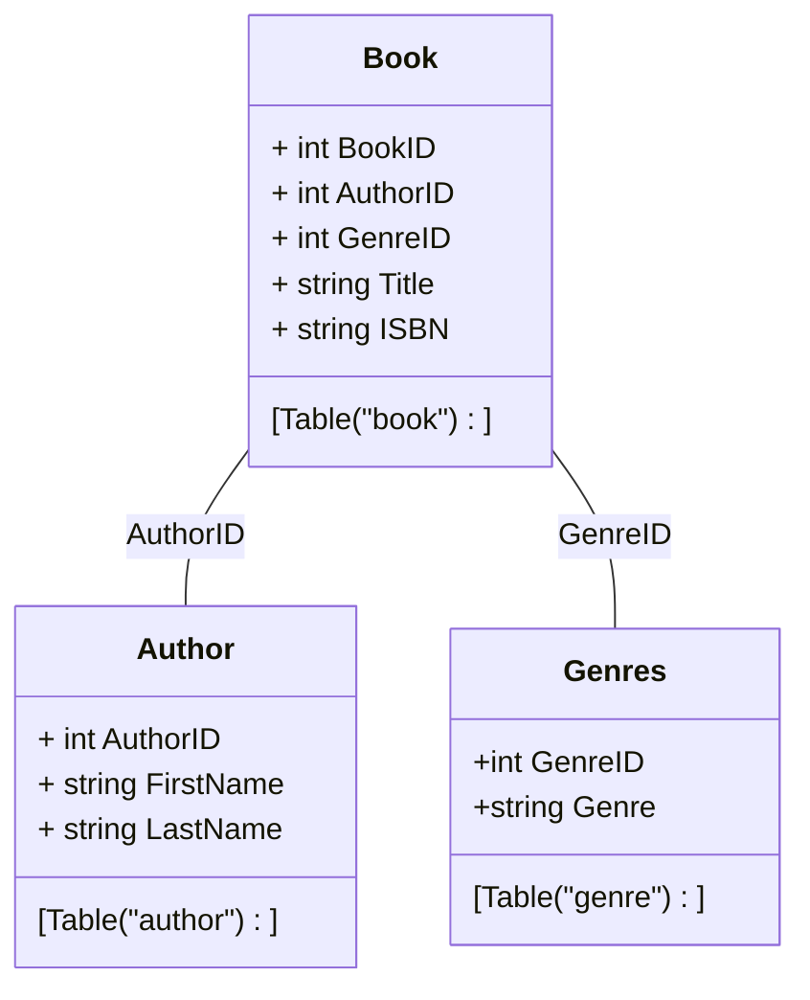

```mermaid
classDiagram
    class Author {
        [Table("author")]
        + int AuthorID
        + string FirstName
        + string LastName
    }

    class Book {
        [Table("book")]
        + int BookID
        + int AuthorID
        + int GenreID
        + string Title
        + string ISBN
    }

    class Genres {
        [Table("genre")]
        +int GenreID
        +string Genre
    }

    Book -- Author : AuthorID
    Book -- Genres : GenreID
```
