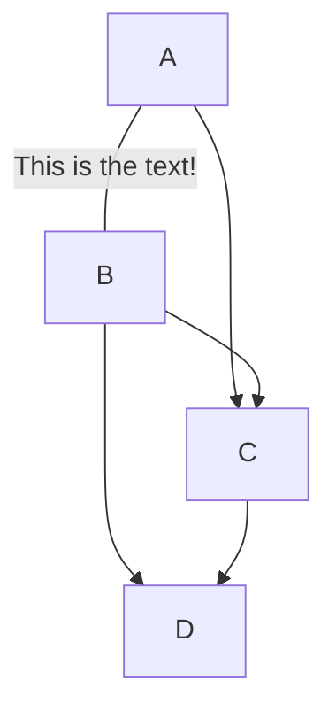

**Title:** Assignment 3
#
**Name:** Cameron Gordon 
# 
**Description:** Learn markdown 
#
**Mermaid Chart Types** 
* Flowchart 
* Sequence diagram 
* Gantt diagram
* Class diagram 

**Favorite markdown documentation:**
 [LaTeX](https://ashki23.github.io/markdown-latex.html)
 
**Emojis:** 
:grinning: :laughing: :sweat_smile: 

**Table:**
<br> 
| Left-Aligned  | Center Aligned  | Right Aligned |
| :------------ |:---------------:| -----:|
| col 3 is      | some wordy text | $1600 |
| col 2 is      | centered        |   $12 | 

**Image:** 
<br>


**Code block:** 
````python 
hello = "hello"
print(hello) 
````

**Mermaid flowchat:** 
<br>

